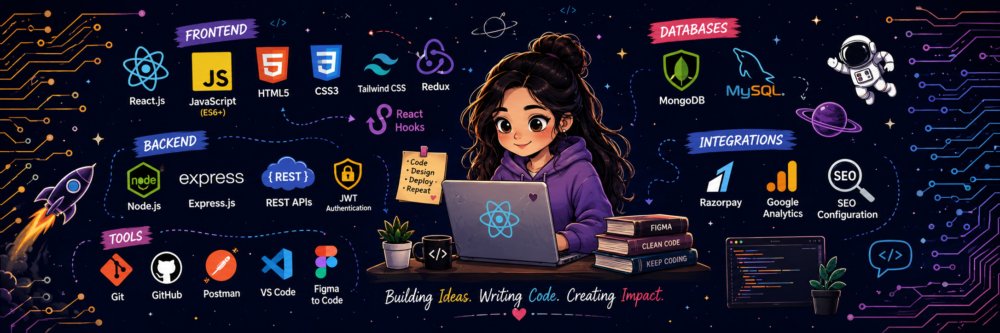
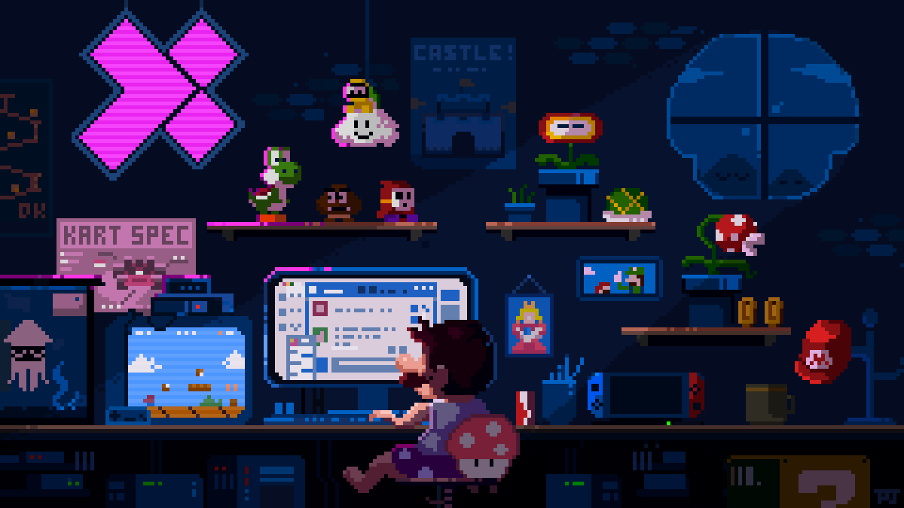
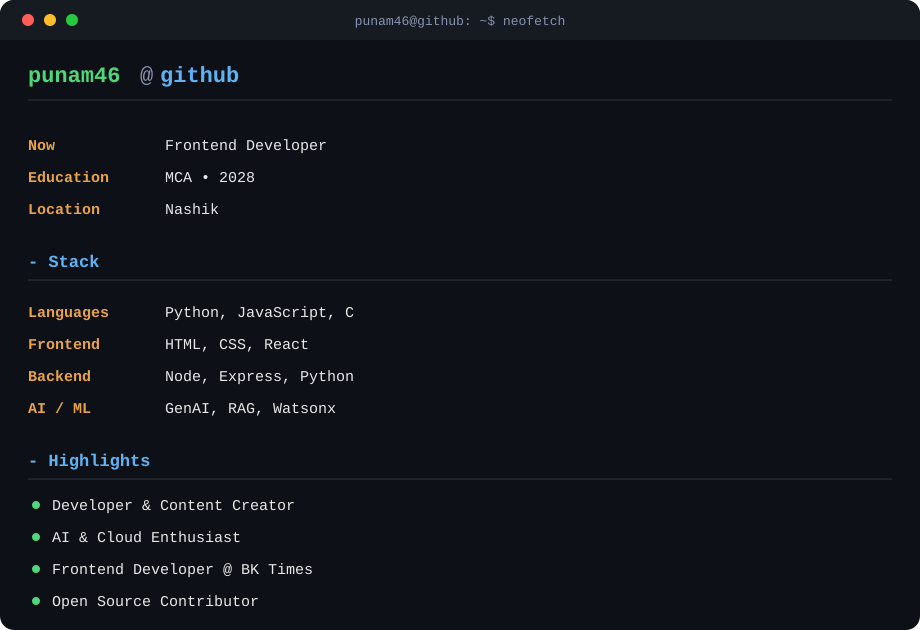
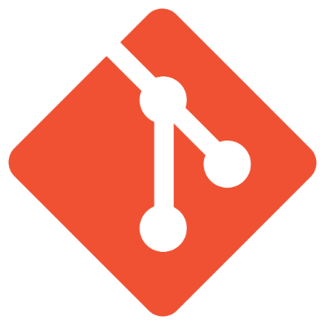

  <h1>Hi 👋, I'm <a href="https://github.com/punam46">Punam</a></h1>
  <h3>Full Stack Developer | Software Engineer | Tech Enthusiast</h3>

   

  

    

  

    
  

  

    
  

---

### 💫 About Me

  

---

### 🛠️ Tech Stack & Tools

| Area | Technologies |
| :--- | :--- |
| **Languages** |      |
| **Cloud & Services** |  |
| **Databases** |   |
| **Tools & OS** |    |

 

  <table>
    <tr>
      <td align="center" width="110"> <b>Python</b></td>
      <td align="center" width="110"> <b>JavaScript</b></td>
      <td align="center" width="110"> <b>HTML5</b></td>
      <td align="center" width="110"> <b>CSS3</b></td>
    </tr>
    <tr>
      <td align="center" width="110"> <b>C</b></td>
      <td align="center" width="110"> <b>GCP</b></td>
      <td align="center" width="110"> <b>MongoDB</b></td>
      <td align="center" width="110"> <b>MySQL</b></td>
    </tr>
    <tr>
      <td align="center" width="110"> <b>Git</b></td>
      <td align="center" width="110"> <b>GitHub</b></td>
      <td align="center" width="110" colspan="2"> <b>Postman</b></td>
    </tr>
  </table>

---

